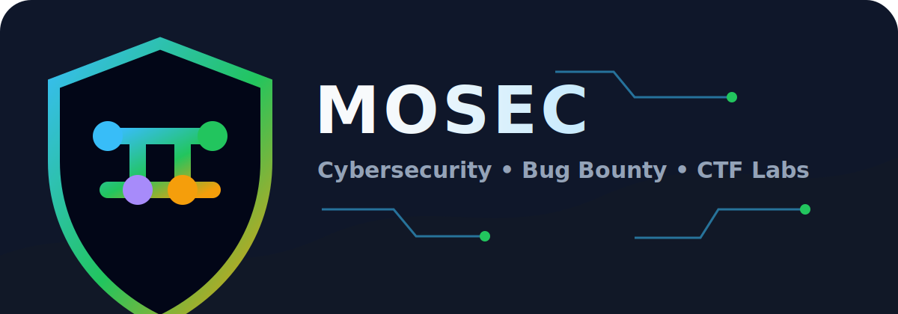

<p align="center">
  
</p>

<h1 align="center">Mohammad Almashahreh</h1>

<p align="center">
  <strong>Cybersecurity student focused on bug bounty, web security, SOC analysis, cloud security, static analysis, and practical security research.</strong>
</p>

<p align="center">
  <a href="https://github.com/mialmashahreh22?tab=repositories">
    
  </a>
  <a href="https://mialmashahreh22.github.io">
    
  </a>
  
  
  
</p>

---

## About Me

I am a cybersecurity student building practical projects around secure coding, bug bounty methodology, web application security, SOC analysis, cloud security, Linux and Windows fundamentals, networking, and static analysis.

My goal is to grow into a strong penetration tester and security researcher by creating hands-on labs, writing clear reports, and turning each security concept into something people can learn from.

## Current Focus

| Area | What I Build |
|---|---|
| Bug bounty | Sanitized bug reports with realistic vulnerable-app simulations |
| Web security | IDOR, token logic, authentication, and business logic cases |
| SOC analysis | Log review, alert triage, detection thinking, and incident notes |
| Cloud security | Identity, access control, storage exposure, and cloud risk basics |
| Static analysis | Semgrep-style rules, code review examples, and safe vulnerable snippets |
| Networking | Beginner-to-intermediate networking labs for cybersecurity |
| System fundamentals | Linux and Windows filesystem guides |
| Tooling | VS Code security extension experiments |

## Featured Projects

| Project | Description |
|---|---|
| [Static Analysis Basics for Cybersecurity](https://github.com/mialmashahreh22/static-analysis-basics-for-cybersecurity) | Colorful guide with Semgrep, YARA, secret scanning, and Code Scanner Quest. |
| [Networking Basics for Cybersecurity](https://github.com/mialmashahreh22/networking-basics-for-cybersecurity) | Practical networking guide with Network Quest interactive lab. |
| [Windows Filesystem Guide](https://github.com/mialmashahreh22/windows-filesystem-guide) | Windows filesystem, PowerShell, permissions, and investigation paths. |
| [Linux Filesystem Guide](https://github.com/mialmashahreh22/linux-filesystem-guide) | Linux directories, permissions, commands, and beginner admin notes. |
| [Vibe Coding Security](https://github.com/mialmashahreh22/vibe-coding-security) | VS Code extension experiment for Semgrep-based secure coding checks. |

## Bug Report Simulation Labs

Each repo explains one bug and includes a realistic browser-based simulation where the flag unlocks after reproducing the issue safely.

| Lab | Bug Class |
|---|---|
| [Email Lifecycle Business Logic Bug](https://github.com/mialmashahreh22/email-lifecycle-business-logic-bug) | Deleted account email remains locked |
| [Password Reset Whitespace Bug](https://github.com/mialmashahreh22/password-reset-whitespace-bug) | Inconsistent password whitespace handling |
| [Unauthorized File Deletion IDOR](https://github.com/mialmashahreh22/unauthorized-file-deletion-idor) | Missing authorization on destructive action |
| [Ticket Reservation Business Logic Bug](https://github.com/mialmashahreh22/ticket-reservation-business-logic-bug) | Unpaid ticket hold abuse |
| [Unsubscribe Endpoint IDOR](https://github.com/mialmashahreh22/unsubscribe-endpoint-idor) | Raw object ID used in unsubscribe flow |
| [Reusable Email Verification Code Bug](https://github.com/mialmashahreh22/reusable-email-verification-code-bug) | Old verification codes remain valid |
| [Unauthenticated API Token Exposure](https://github.com/mialmashahreh22/unauthenticated-api-token-exposure) | Credential endpoint exposed without login |

## Tools I Am Practicing

<p>
  
  
  
  
  
  
  
  
</p>

## Learning Path

```text
System fundamentals -> Networking -> Web security -> SOC analysis -> Cloud security -> Static analysis -> Bug bounty reports
```

## Contact

- GitHub: [@mialmashahreh22](https://github.com/mialmashahreh22)
- Portfolio: [mialmashahreh22.github.io](https://mialmashahreh22.github.io)
